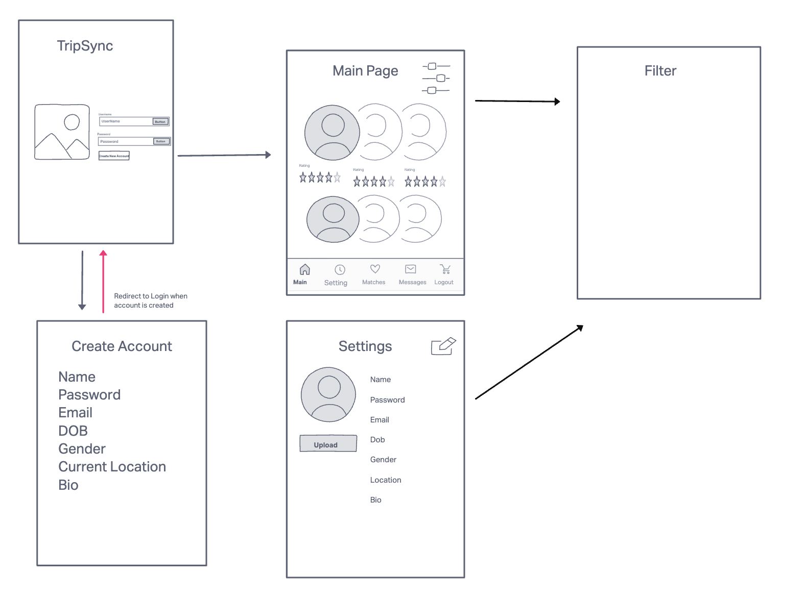

# octSprint

TripSync is a dating app designed for digital nomads and avid travelers seeking compatible partners to join them on their adventures. TripSync allow users to find like-minded companions for their journeys.

## TripSync (DigitalDuo)
1. Pre-Trip Matching: Users can specify their upcoming travel plans, including destination, dates, and activities, to find potential travel partners with similar itineraries and interests.
2. Filters: Provide filters based on travel interests or specific industry backgrounds to help users find compatible travel partners with other digital nomads or backpackers.  
3. Safety Measures: Implement safety features such as emergency contacts, SOS alerts, and safety tips for traveling in different regions, ensuring the well-being of users during their trips.
4. Post-Trip Sharing: Allow users to share their travel experiences and rate travel partners.

## WireFrame (under construction)

